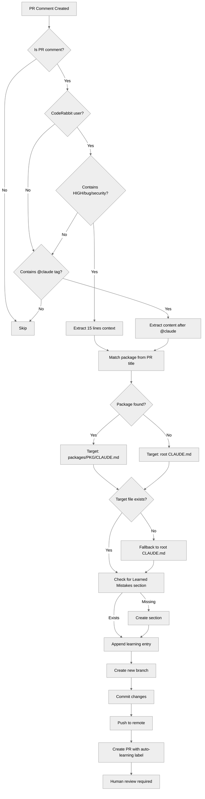

# Golems Monorepo

> Autonomous AI agent ecosystem — Bun workspace with 13 packages. Each golem is a self-contained CC plugin.

---

## Packages

| Package | CLAUDE.md | Purpose |
|---------|-----------|---------|
| **@golems/shared** | [`packages/shared/`](packages/shared/CLAUDE.md) | Supabase, LLM, email, state, notifications |
| **@golems/claude** | [`packages/claude/`](packages/claude/CLAUDE.md) | Telegram bot, orchestrator, external face |
| **@golems/jobs** | [`packages/jobs/`](packages/jobs/CLAUDE.md) | Job scraping, matching, ATS |
| **@golems/recruiter** | [`packages/recruiter/`](packages/recruiter/CLAUDE.md) | Outreach, interview practice, contacts |
| **@golems/teller** | [`packages/teller/`](packages/teller/CLAUDE.md) | Finance, subscriptions, tax |
| **@golems/content** | [`packages/content/`](packages/content/CLAUDE.md) | Visual content factory (Remotion, ComfyUI, dataviz) + text publishing |
| **@golems/coach** | [`packages/coach/`](packages/coach/CLAUDE.md) | Calendar, schedule, life planning |
| **@golems/services** | [`packages/services/`](packages/services/CLAUDE.md) | Night Shift, Briefing, Cloud Worker, Doctor, Wizard |
| **@golems/orchestrator** | [`packages/orchestrator/`](packages/orchestrator/CLAUDE.md) | n8n orchestration, render microservice |
| **dashboard** | [`packages/dashboard/`](packages/dashboard/CLAUDE.md) | Next.js web dashboard (brain view, ops, backlog, content, tokens) |
| **golems-tui** | `packages/golems-tui/` | React Ink terminal dashboard |
| **tax-helper** | [`packages/tax-helper/`](packages/tax-helper/CLAUDE.md) | Schedule C transaction categorization (Sophtron MCP) |
| **ralph** | [`packages/ralph/`](packages/ralph/CLAUDE.md) | Autonomous coding loop (PRD execution) |
| **brainlayer** | [github.com/EtanHey/brainlayer](https://github.com/EtanHey/brainlayer) | Memory layer — external repo (Python + sqlite-vec, 260K+ chunks) |
| **voicelayer** | [github.com/EtanHey/voicelayer](https://github.com/EtanHey/voicelayer) | Voice I/O layer — external repo (MCP server, edge-tts, whisper.cpp, session booking) |

**Always read the package-specific CLAUDE.md when working in that package.**

---

## Architecture

```
golems/                              # Bun workspace monorepo
├── packages/shared/                 # @golems/shared — extracted utilities
├── packages/claude/                 # ClaudeGolem — orchestrator + Telegram
├── packages/recruiter/              # RecruiterGolem — outreach, practice
├── packages/teller/                 # TellerGolem — finances, categorization
├── packages/jobs/                   # JobGolem — scraping, ATS, matching
├── packages/content/                # ContentGolem — visual content + publishing
├── packages/orchestrator/           # n8n orchestration + Bun render microservice
├── packages/coach/                  # CoachGolem — schedule, calendar
├── packages/services/               # Night Shift, Briefing, Cloud Worker
├── packages/dashboard/              # Next.js web dashboard (Vercel)
├── packages/golems-tui/             # React Ink terminal dashboard
├── packages/tax-helper/             # Schedule C tax categorization
├── packages/autonomous/             # Legacy stranglers (1-line re-exports)
├── packages/ralph/                  # Autonomous coding loop (PRD execution)
├── (voicelayer → external repo)      # Voice I/O layer (github.com/EtanHey/voicelayer)
├── launchd/                         # macOS service plists
├── Dockerfile                       # Root workspace Dockerfile (Railway)
└── railway.json                     # Railway deploy config
```

### Key Relationships

- **ClaudeGolem** registers Composers from Jobs + Recruiter for Telegram commands
- **CoachGolem** reads getStatus() from Jobs, Recruiter, Teller (read-only)
- **Services** (briefing) imports from Coach for daily plan generation
- **Cloud Worker** runs Jobs + Email golems on Railway schedules
- **All packages** depend on Shared for Supabase, LLM, state, notifications

---

## Development

```bash
# Install all workspace deps
bun install

# Run all tests
bun test

# Work on a specific package
cd packages/claude && cat CLAUDE.md

# Run telegram bot locally
bun packages/claude/src/telegram-bot.ts

# CLI
golems status          # Service overview
golems doctor          # Health checks
golems wizard          # Guided setup
```

---

## Deployment

| Environment | What Runs | Where |
|-------------|-----------|-------|
| **Local (Mac)** | Telegram bot, Night Shift, Briefing | launchd plists |
| **Railway** | Email poller, Job scraper, Soltome learner | Cloud Worker |
| **Vercel** | Dashboard (Next.js) | `etanheyman.com` |
| **Supabase** | Database, auth, storage | Cloud |

---

## MCP Servers

| Server | Command | Purpose |
|--------|---------|---------|
| **brainlayer** | `brainlayer-mcp` | Memory layer — search 260K+ indexed conversation chunks across 9 projects ([BrainLayer](https://github.com/EtanHey/brainlayer)) |
| **golems-email** | `bun run packages/shared/src/email/mcp-server.ts` | Email triage — recent, search, subscriptions, urgent, draft replies |
| **golems-jobs** | `bun run packages/jobs/src/mcp-server.ts` | Job discovery — recent matches, search, stats |
| **supabase** | `@supabase/mcp-server-supabase` | Database access — tables, SQL, migrations, types |
| **exa** | `exa-mcp-server` | Web search — code context, company research |
| **golems-glm** | `bun run packages/shared/src/glm/mcp-server.ts` | Local GLM-4.7-Flash — summarize text, score/classify with JSON output |
| **sophtron** | `@sophtron/sophtron-mcp-server` | Bank account access — transactions, identity |
| **voicelayer** | `bun run ~/Gits/voicelayer/src/mcp-server.ts` | Voice I/O layer — external repo ([VoiceLayer](https://github.com/EtanHey/voicelayer)) |

### BrainLayer MCP (3 Tools)

[BrainLayer](https://github.com/EtanHey/brainlayer) provides persistent memory across Claude Code sessions:
- **`brain_search`**: Unified search — pass query, file_path, chunk_id, or filters. Auto-routes to the right view.
- **`brain_store`**: Save decisions, learnings, mistakes, ideas. Type and importance auto-detected from content.
- **`brain_recall`**: Current context, sessions, operations, plan links. Mode defaults to "context".

All 14 old `brainlayer_*` tool names still work as backward-compat aliases.

### VoiceLayer MCP (2 Tools)

[VoiceLayer](https://github.com/EtanHey/voicelayer) provides voice I/O:
- **`voice_speak`**: NON-BLOCKING TTS with auto-mode detection (announce/brief/consult/think). Also handles replay and toggle.
- **`voice_ask`**: BLOCKING — speaks question, records mic, returns transcription via Silero VAD + whisper.cpp.

All 9 old `qa_voice_*` tool names still work as backward-compat aliases.

---

## Shared Resources

| Path | Purpose |
|------|---------|
| `.claude/agents/` | Agent profiles for `/agents` command |
| `.claude/rules/` | Auto-loaded rules (survives compaction) |
| `rules-library/` | Exportable context/rules library |
| `docs/architecture/` | Architecture decisions (indexed by BrainLayer) |
| `skills/golem-powers/` | Skills (symlinked to ralph) |
| `docs/plan/` | Active plans and phase tracking |
| `launchd/` | macOS launchd service plists |

### Worktree-Isolated Agents

Some agents run with `isolation: worktree` — they get their own git worktree to prevent file conflicts with the main workspace:

| Agent | Purpose |
|-------|---------|
| `migration-worker` | Database migrations and schema changes |
| `qa-voice` | Voice-powered QA testing with Playwright |
| `discovery-voice` | Client discovery call assistant |

Use these for tasks that modify files heavily or run in parallel with main workspace work.

---

## Communication Style

Based on Zikaron analysis of owner's patterns:
- **Formality:** 2/10 - Very casual
- **Length:** Brief, direct
- **Tone:** Friendly, sometimes playful

See `packages/claude/SOUL.md` for bot persona.

---

## Learned Mistakes


### 2026-02-23 — PR #242
**Source:** greptile-apps[bot] on PR #242
**PR:** feat: Phase 17 — PR auto-learning GitHub Action

` tags to automatically extract learnings and create PRs updating CLAUDE.md files. The workflow uses `issue_comment` events, parses HIGH/bug/security keywords from CodeRabbit comments, determines target package CLAUDE.md files, and creates a new PR for human approval before merge.

Major changes:
- Triggers on `issue_comment` with filters for `coderabbitai` user + severity keywords or `@claude` tags
- Extracts 15 lines of context from CodeRabbit comments containing HIGH/bug/security patterns
- Determines target CLAUDE.md based on PR title pattern matching (root fallback)
- Appends formatted learning entry with date, source, and content
- Creates new branch and PR with `auto-learning` label

Issues found:
- **Package detection logic** only checks PR title, misses actual changed files, excludes `golems-tui` and `autonomous` packages
- **Shell comparison bug** on line 164 will never match (compares against wrong value)
- **Heredoc formatting** may have issues with multiline content expansion
- **No duplicate check** before creating PR (could create empty commits)
- **Shallow checkout** prevents inspecting PR diff for better package detection
</details>


<h3>Confidence Score: 3/5</h3>

- This PR is moderately safe to merge but has several logic bugs that will prevent it from working correctly in production.
- The workflow has sound architecture (creates PRs rather than direct commits, requires human approval) but contains multiple implementation bugs: the shell comparison on line 164 will never match the actual source value, the package detection misses several packages and doesn't check actual file changes, the heredoc may have expansion issues, and there's no check for duplicate/empty commits. These are not security issues but will cause runtime failures or incorrect behavior.
- `.github/workflows/claude-learning.yml` requires fixes to the shell comparison logic, package detection, and commit validation before this will work correctly in production.

<details open><summary><h3>Important Files Changed</h3></summary>


| Filename | Overview |
|----------|----------|
| .github/workflows/claude-learning.yml | New GitHub Action to auto-extract learnings from CodeRabbit/team comments and create PRs to update CLAUDE.md files. Has logic bug in package detection and potential heredoc issues. |

</details>


</details>


<h3>Flowchart</h3>



<sub>Last reviewed commit: da7f1de</sub>

