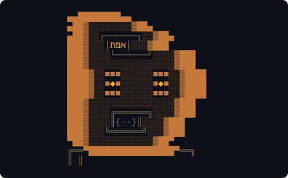

<p align="center">
  
</p>

<h1 align="center">Golems</h1>

<p align="center">
  <strong>AI agents that work everywhere you do.</strong><br />
  <sub>Skills, plugins, and autonomous agents — use them in Claude Code, Telegram, any CLI, or Cowork (coming soon).</sub>
</p>

<p align="center">
  <a href="https://etanheyman.com/golems/"></a>
  <a href="packages/recruiter/"></a>
  <a href="packages/teller/"></a>
  <a href="packages/coach/"></a>
</p>

---

## What is this?

Golems is a personal AI agent ecosystem built as a **Bun workspace monorepo**. Each golem is a self-contained **Claude Code plugin** — install one into any Claude session and it brings its skills, rules, and context with it.

**Use golems through any surface:**

| Surface | How | Status |
|---------|-----|--------|
| **Claude Code** | `claude --plugin-dir packages/recruiter` — any golem as a plugin | Live |
| **`/agents`** | Named agent profiles with specialized personalities | Live |
| **Telegram** | ClaudeGolem bot routes to domain golems via Composers | Live |
| **CLI** | `golems status`, `golems doctor`, `golems wizard` | Live |
| **Any AI agent** | Clone the repo, grab the skills/rules you need | Live |
| **Claude Cowork** | Same plugins + skills in collaborative workspace | Live |

It's not a Telegram bot — it's a **collection of skills, rules, MCP tools, and agent profiles** bundled into an ecosystem. Telegram is just one surface. A Codex agent, a Cursor session, or a fresh Claude Code instance can all use golems by pointing at the plugin directory.

Your Mac runs the brain (Telegram bot, Night Shift, memory). Railway runs the body (email polling, job scraping, briefings). Every conversation gets indexed into searchable memory via [Zikaron](packages/zikaron/) (238K+ chunks).

---

## Quick Start

```bash
git clone https://github.com/EtanHey/golems.git && cd golems
bun install
golems wizard      # Interactive setup — picks services, wires keys
golems status      # See what's running
```

**[Full docs →](https://etanheyman.com/golems/)**

---

## Architecture

Four **domain golems** + an **orchestrator** + **tools** + **infrastructure**.

### Golems (Domain Agents)

| | Golem | Domain | What it does |
|---|---|---|---|
| 👔 | **RecruiterGolem** | Recruitment | Finds contacts via GitHub + Exa + Hunter. Outreach campaigns. 7 interview practice modes with Elo tracking. |
| 💰 | **TellerGolem** | Finance | Categorizes transactions for tax. Payment failure alerts. Monthly expense reports. |
| 🗓️ | **CoachGolem** | Scheduling | Calendar management. Daily plans. Reads status from all other golems. |
| ✍️ | **ContentGolem** | Publishing | Visual content factory (Remotion, ComfyUI, dataviz) + LinkedIn posts, Soltome, ghostwriting. |

### Orchestrator

| | Component | Role |
|---|---|---|
| 🤖 | **ClaudeGolem** | Persistent Telegram bot. Routes messages to golems. Manages Night Shift + briefings. |

### Tools & Layers

| Component | Role |
|---|---|
| **Job Scraping** | Scrapes boards (Indeed, SecretTLV, Drushim, Goozali). LLM scoring. Auto-outreach for 8+ matches. |
| **Email** | Scores incoming email 0-10. Routes to domain golems. Drafts replies. Lives in @golems/shared. |

### Infrastructure

| Component | Role |
|---|---|
| **Night Shift** | Runs at 4am. Scans repos for TODOs, creates PRs, sends morning briefing. |
| **Shared** | Supabase, LLM abstraction, state store, notifications, event log. |

---

## Packages

```
golems/
├── packages/
│   ├── claude/         # ClaudeGolem — Telegram bot + orchestrator
│   ├── recruiter/      # RecruiterGolem — outreach, contacts, interview practice
│   ├── teller/         # TellerGolem — finance, tax, subscriptions
│   ├── coach/          # CoachGolem — calendar, daily plans
│   ├── jobs/           # JobGolem — job scraping, LLM matching, auto-outreach
│   ├── shared/         # Supabase, LLM, email, state, notifications
│   ├── services/       # Night Shift, Briefing, Cloud Worker, Doctor, Wizard
│   ├── content/        # Visual content factory (Remotion, ComfyUI, dataviz) + publishing
│   ├── dashboard/      # Next.js web dashboard (Vercel)
│   ├── orchestrator/   # n8n orchestration + Bun render microservice
│   ├── tax-helper/     # Schedule C transaction categorization (Sophtron MCP)
│   ├── golems-tui/     # React Ink terminal dashboard
│   ├── autonomous/     # Legacy test host (test files only)
│   ├── ralph/          # Autonomous coding loop (PRD → stories → code → review)
│   └── zikaron/        # Memory layer (238K+ chunks, semantic search)
├── .claude/agents/     # 7 named agent profiles (/agents)
├── .claude/rules/      # Auto-loaded rules (survives compaction)
├── skills/             # 30+ golem-powers skills in 6 categories
├── rules-library/      # Exportable rules for any Claude Code project
├── docs/architecture/  # Architecture decisions (Zikaron-indexed)
├── launchd/            # macOS service plists
└── Dockerfile          # Railway deployment
```

---

## Tech Stack

| Layer | Tech |
|-------|------|
| **Runtime** | Bun + TypeScript |
| **LLM** | Claude Code (Opus/Sonnet/Haiku), Gemini CLI, Cursor CLI |
| **Database** | Supabase (Postgres + RLS) |
| **Memory** | sqlite-vec + bge-large-en-v1.5 embeddings (238K+ chunks) |
| **Cloud** | Railway (Docker) |
| **Local** | macOS launchd services |
| **Bot** | grammY (Telegram) |
| **Testing** | Bun test (1,148 tests, 3,990 assertions) |
| **CI/CD** | GitHub Actions + CodeRabbit + DeepSource |

---

## Deployment

| Environment | What Runs |
|-------------|-----------|
| **Mac (brain)** | Telegram bot, Night Shift, Zikaron, notification server |
| **Railway (body)** | Email poller, job scraper, briefing, cloud LLM (Gemini) |
| **Supabase** | Database, auth, storage |

```
  Claude Code ──┐
    Telegram ───┤
     Cowork ────┼──→  Golem Plugins  ──→  Skills + MCP + Rules
      CLI ──────┤
  Any agent ────┘
                     ┌─────────┐┌─────────┐┌─────────┐┌─────────┐
                     │Recruiter││ Teller  ││  Coach  ││ Content │
                     │  Golem  ││  Golem  ││  Golem  ││  Golem  │
                     └────┬────┘└────┬────┘└────┬────┘└────┬────┘
                          └─────┬────┴─────┬────┘          │
                                ▼          ▼               │
                     ┌──────────┐┌──────────┐┌──────────┐  │
                     │  Email + ││ Services ││  Zikaron │◄─┘
                     │   Jobs   ││ (Railway)││ (memory) │
                     └──────────┘└──────────┘└──────────┘
```

---

## Telegram

Two topics in the group:
- **General** — interactive ClaudeGolem chat
- **Alerts** — all one-way notifications (jobs, email, nightshift, health)

Commands: `/status` `/trigger` `/tonight` `/morning` `/jobs` `/admin`

---

## CLI

```bash
golems status          # Service overview
golems doctor          # Health checks
golems wizard          # Guided setup
golems skills          # List all skills
golems rules check     # Audit rules for a project
golems scrape          # Trigger job search
golems logs telegram   # View service logs
```

---

## Use as a Plugin

Each golem is a Claude Code plugin. Install one into any session:

```bash
# Use RecruiterGolem for interview practice
claude --plugin-dir ~/Gits/golems/packages/recruiter

# Use TellerGolem for tax categorization
claude --plugin-dir ~/Gits/golems/packages/teller

# Use the whole ecosystem
claude --plugin-dir ~/Gits/golems
```

The plugin brings its CLAUDE.md, skills, MCP tools, and rules automatically.

---

## Agent Profiles

7 named agents via `/agents` — each with specialized system prompts and tool access:

| Agent | Domain |
|-------|--------|
| `recruiter` | Interview practice, outreach, contacts |
| `coach` | Calendar, daily plans, priorities |
| `jobs` | Job scraping, matching, quality |
| `content` | LinkedIn, Soltome, ghostwriting |
| `services` | Night Shift, Briefing, Doctor, Wizard |
| `orchestrator` | Telegram routing, ecosystem coordination |
| `tax-helper` | Bank transactions, deductions, Schedule C |

---

## MCP Servers

| Server | What it does |
|--------|-------------|
| **zikaron** | Search 238K+ indexed conversation chunks — persistent memory across sessions |
| **golems-email** | Email triage — recent, search, subscriptions, urgent, draft replies |
| **golems-jobs** | Job discovery — recent matches, search, stats |
| **supabase** | Database access — tables, SQL, migrations |
| **exa** | Web search — code context, company research |
| **sophtron** | Bank account and transaction access — feeds TellerGolem tax categorization |

---

## Links

- **[Documentation](https://etanheyman.com/golems/docs/getting-started)** — interactive docs
- **[ClaudeGolem](https://etanheyman.com/golems/docs/golems/claude)** — Telegram orchestrator bot docs
- **[etanheyman.com](https://etanheyman.com)** — portfolio

---

<sub>Built by <a href="https://github.com/EtanHey">@EtanHey</a> with Claude Code. Golems write code at 4am so you don't have to.</sub>
