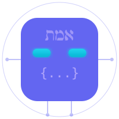

<p align="center">
  
</p>

<h1 align="center">Golems</h1>

<p align="center">
  <strong>AI agents that run while you sleep.</strong><br />
  <sub>Job scraping. Email triage. Tax tracking. Code at 4am. All reported via Telegram.</sub>
</p>

<p align="center">
  <a href="https://etanhey.github.io/golems/"></a>
  <a href="https://etanhey.github.io/golems/themes"></a>
  <a href="packages/ralph/"></a>
  <a href="packages/zikaron/"></a>
</p>

---

## What is this?

Golems is a personal AI agent ecosystem. Six specialized agents handle different parts of your life — jobs, email, finances, recruitment, code improvements — and coordinate through a Telegram group with topic-based channels.

Your Mac runs the brain (Telegram bot, Night Shift, memory). Railway runs the body (email polling, job scraping, briefings).

Every conversation, every decision, every result gets indexed into searchable memory via [Zikaron](packages/zikaron/).

---

## Quick Start

```bash
git clone https://github.com/EtanHey/golems.git && cd golems
bun install
golems wizard      # Interactive setup — picks services, wires keys
golems status      # See what's running
```

That's it. The wizard handles Telegram tokens, 1Password secrets, launchd services, and Railway deployment.

**[Full setup guide →](https://etanhey.github.io/golems/docs/getting-started)**

---

## The Golems

Each golem owns a **domain**, not an I/O channel. They share memory, coordinate via events, and report through Telegram.

| | Golem | Domain | What it actually does |
|---|---|---|---|
| 🤖 | **ClaudeGolem** | Orchestration | Persistent Claude sessions. Manages Night Shift, runs briefings, handles Telegram chat. |
| 📧 | **EmailGolem** | Email | Scores incoming email 0-10. Routes to domain golems. Drafts replies. Tracks follow-ups. |
| 💼 | **RecruiterGolem** | Recruitment | Finds contacts via GitHub + Exa + Hunter. Runs outreach campaigns. 7 interview practice modes with Elo tracking. |
| 💰 | **TellerGolem** | Finance | Categorizes transactions for tax. Payment failure alerts. Monthly expense reports. |
| 🎯 | **JobGolem** | Job search | Scrapes Indeed, SecretTLV, Drushim, Goozali. LLM-scores matches against your profile. Auto-outreach to top matches. |
| 🌙 | **NightShift** | Maintenance | Runs at 4am. Scans repos for TODOs, creates PRs, runs tests. Sends morning briefing with results. |

---

## Packages

```
golems/
├── packages/
│   ├── autonomous/    # All 6 golems + Telegram bot
│   ├── ralph/         # Autonomous coding loop (PRD → stories → code → review → commit)
│   ├── zikaron/       # Memory layer (200k+ chunks, semantic search, <2s)
│   ├── docsite/       # Documentation site (live at etanhey.github.io/golems)
│   └── admin-ui/      # Dashboard (golem status, email triage, job matches, finances)
├── skills/            # 34 golem-powers skills in 6 categories
└── contexts/          # Shared Claude context files
```

### Ralph — Autonomous Coding

Write stories in a PRD, Ralph executes them with Claude Code. CodeRabbit reviews each one. Green? Committed. Red? Loops.

```bash
./ralph.zsh 5   # Execute 5 stories autonomously
```

Smart model routing: Opus plans, Sonnet implements, Haiku verifies. Git worktree isolation so nothing bleeds.

### Zikaron — Memory Layer

Every Claude conversation gets indexed into searchable memory. Hybrid search (BM25 + semantic vectors) using sqlite-vec and bge-large-en-v1.5 embeddings.

```bash
zikaron search-fast "how to handle auth"   # <2s results
```

### Autonomous — The Golems

All 6 golems plus the Telegram bot. Scheduled via launchd (Mac) and Railway (cloud).

```bash
bun run bot          # Start Telegram bot
bun run nightshift   # Trigger Night Shift manually
golems doctor        # Health check all services
```

---

## Architecture

```
  You ←──── Telegram ────→ ClaudeGolem
                              │
              ┌───────────────┼───────────────┐
              ▼               ▼               ▼
        ┌──────────┐   ┌──────────┐   ┌──────────┐
        │  Night   │   │  Morning │   │  Ralph   │
        │  Shift   │   │ Briefing │   │  (PRDs)  │
        └────┬─────┘   └────┬─────┘   └────┬─────┘
             │               │               │
             └───────┬───────┴───────┬───────┘
                     ▼               ▼
             ┌──────────────┐  ┌──────────┐
             │    Golems    │  │  Zikaron │
             │  (6 agents)  │  │ (memory) │
             └──────────────┘  └──────────┘

  ── Mac (brain) ──          ── Railway (body) ──
  Telegram Bot               Email Poller
  Night Shift                Job Scraper
  Zikaron Memory             Briefing Generator
  Notification Server        Cloud LLM (Haiku)
```

---

## CLI Helpers

Golems orchestrates multiple AI tools. Claude is the brain, helpers handle the grunt work:

| Tool | What it does | Cost |
|------|-------------|------|
| **Gemini CLI** | Research, web search, doc audits | Free |
| **Cursor CLI** | Codebase sweeps, CSS, indexed search | $20/mo |
| **Codex CLI** | Sandboxed code gen, reviews | ChatGPT Plus |
| **Kiro CLI** | Knowledge base, custom agents | Free |

Priority: free tools first, paid tools when needed, Claude subagents as last resort.

---

## Skills

34 skills in [`skills/`](skills/), organized by category:

| Category | Examples |
|----------|---------|
| **Development** | commit, PR creation, test plans, worktrees, TDD |
| **Operations** | 1Password, Convex, Supabase, Brave automation |
| **Content** | drafting, publishing, style adaptation |
| **Review** | CodeRabbit workflows, critique waves, context audits |
| **AI Tools** | interview practice, LSP intelligence, zikaron search |
| **Meta** | skill discovery, skill authoring, project context |

```bash
golems skills          # List all available skills
golems skills search   # Search by keyword
```

---

## Links

- **[Documentation](https://etanhey.github.io/golems/)** — interactive docs with terminal demos
- **[Color Themes](https://etanhey.github.io/golems/themes)** — 5 palette variations
- **[@GolemZikaronBot](https://t.me/GolemZikaronBot)** — Telegram bot (live)
- **[etanheyman.com](https://etanheyman.com)** — portfolio

---

<sub>Built by <a href="https://github.com/EtanHey">@EtanHey</a> with Claude Code. Golems write code at 4am so you don't have to.</sub>
