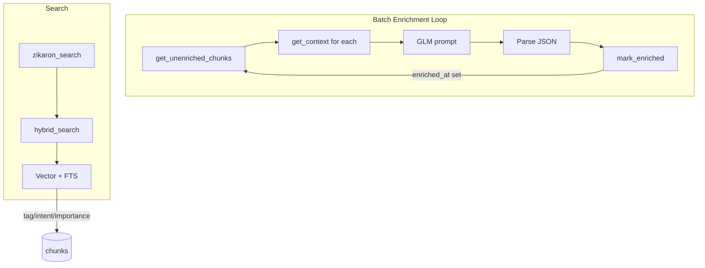

# Zikaron Phase 5: Cursor Findings

Findings from analyzing `packages/zikaron/src/zikaron/vector_store.py`, `packages/zikaron/src/zikaron/mcp/__init__.py`, and related code for LLM-powered enrichment of 226K chunks.

---

## 1. Chunks table vs chunk_enrichment table

**Recommendation: Add columns to `chunks` table.**

The existing schema already has unused columns (`tags`, `tag_confidence`, `context_summary`) added via ALTER TABLE. Adding enrichment columns follows the same pattern and keeps queries simple.

**Why not a separate table:**
- `search()` and `hybrid_search()` JOIN `chunks` with `chunk_vectors` and `chunks_fts`. Adding another JOIN to `chunk_enrichment` would complicate every query and hurt performance.
- Filtering by tag/intent/importance would require a JOIN for every search.
- No compelling reason to separate: enrichment is 1:1 with chunks, not a log of changes.

**Schema additions** (add to the ALTER loop in `_init_db`):

```python
# In vector_store.py _init_db(), extend the for col, typ loop:
for col, typ in [
    # ... existing ...
    ("tags", "TEXT"), ("tag_confidence", "REAL"), ("context_summary", "TEXT"),
    ("summary", "TEXT"),      # LLM-generated summary (context_summary can stay for legacy)
    ("importance", "REAL"),   # 1-10
    ("intent", "TEXT"),       # debugging | designing | configuring | discussing | deciding
    ("enriched_at", "TEXT"),  # ISO8601 timestamp; NULL = not enriched (enables resumability)
]:
```

**Tags storage:** Store as JSON array string, e.g. `["bug-fix","auth","claude-cli"]`. SQLite's `json_each` / `json_extract` supports filtering. Alternative: comma-separated if you prefer simpler LIKE queries (less precise).

**Index for filtering:**

```python
cursor.execute("CREATE INDEX IF NOT EXISTS idx_chunks_intent ON chunks(intent)")
cursor.execute("CREATE INDEX IF NOT EXISTS idx_chunks_importance ON chunks(importance)")
cursor.execute("CREATE INDEX IF NOT EXISTS idx_chunks_enriched ON chunks(enriched_at)")
```

---

## 2. Tag/intent/importance filtering in search() and hybrid_search()

Both methods build `where_clauses` and `params` for the main query. Add the same pattern for the new filters.

### search() changes

**Vector path** (lines 177-212): Add to `where_clauses`/`params`:

```python
# Add params to search() signature:
tag_filter: Optional[str] = None,           # Single tag to match (json_each)
intent_filter: Optional[str] = None,
importance_min: Optional[float] = None,

# In the vector query branch:
if tag_filter:
    where_clauses.append("EXISTS (SELECT 1 FROM json_each(c.tags) WHERE value = ?)")
    params.insert(-1, tag_filter)
if intent_filter:
    where_clauses.append("c.intent = ?")
    params.insert(-1, intent_filter)
if importance_min is not None:
    where_clauses.append("c.importance >= ?")
    params.insert(-1, importance_min)
```

**Text path** (lines 214-246): Same clauses, but `c.` prefix not needed (query is on `chunks` directly).

**Caveat:** `tags` can be NULL or invalid JSON. Guard:

```python
if tag_filter:
    where_clauses.append("c.tags IS NOT NULL AND json_valid(c.tags) = 1 AND EXISTS (SELECT 1 FROM json_each(c.tags) WHERE value = ?)")
```

### hybrid_search() changes

1. **Pass-through:** Add `tag_filter`, `intent_filter`, `importance_min` to `hybrid_search()` signature and pass them to `self.search()`.

2. **FTS5 branch:** The FTS query at lines 371-380 JOINs `chunks_fts` with `chunks`. Add filter clauses:

```python
fts_extra = []
fts_params = [query_text, n_results * 3]
if tag_filter:
    fts_extra.append("AND c.tags IS NOT NULL AND json_valid(c.tags) = 1 AND EXISTS (SELECT 1 FROM json_each(c.tags) WHERE value = ?)")
    fts_params.insert(-1, tag_filter)
if intent_filter:
    fts_extra.append("AND c.intent = ?")
    fts_params.insert(-1, intent_filter)
if importance_min is not None:
    fts_extra.append("AND c.importance >= ?")
    fts_params.insert(-1, importance_min)

fts_results = list(cursor.execute(f"""
    SELECT f.chunk_id, f.rank, ...
    FROM chunks_fts f JOIN chunks c ON f.chunk_id = c.id
    WHERE chunks_fts MATCH ? {" ".join(fts_extra)}
    ORDER BY f.rank LIMIT ?
""", fts_params))
```

3. **RRF loop** (lines 332-336): The post-filter for FTS-only results should also check tag/intent/importance so FTS hits that don't match filters are excluded.

**Efficiency:** Indexes on `intent` and `importance` make these filters cheap. Tag filtering via `json_each` is slower but acceptable for 226K rows; consider a materialized `tags` FTS table later if needed.

---

## 3. New zikaron_search filter params

In `packages/zikaron/src/zikaron/mcp/__init__.py`, extend the `zikaron_search` tool schema and `_search`:

**Input schema additions:**

```python
"tag": {
    "type": "string",
    "description": "Filter by tag (e.g. 'bug-fix', 'auth'). Chunk must have this tag."
},
"intent": {
    "type": "string",
    "enum": ["debugging", "designing", "configuring", "discussing", "deciding"],
    "description": "Filter by intent classification."
},
"importance_min": {
    "type": "number",
    "minimum": 1,
    "maximum": 10,
    "description": "Minimum importance score (1-10). Only chunks with importance >= this value."
}
```

**`_search` changes:**

```python
results = store.hybrid_search(
    # ... existing ...
    tag_filter=arguments.get("tag"),
    intent_filter=arguments.get("intent"),
    importance_min=arguments.get("importance_min"),
)
```

**Output:** Include `summary` in the result display when present (e.g. under each result) so users get faster context without opening `zikaron_context`.

---

## 4. Resumable batch processing

**Tracking mechanism:** Use `enriched_at` column. `NULL` = not enriched, ISO8601 string = enriched. Simple and doesn't require a separate table.

**Query for unenriched chunks:**

```python
def get_unenriched_chunks(self, batch_size: int = 100, offset: int = 0) -> List[Dict[str, Any]]:
    """Get chunks where enriched_at IS NULL for batch processing."""
    cursor = self.conn.cursor()
    results = list(cursor.execute("""
        SELECT id, content, metadata, source_file, project, content_type,
               conversation_id, position
        FROM chunks
        WHERE enriched_at IS NULL
        ORDER BY id
        LIMIT ? OFFSET ?
    """, (batch_size, offset)))
    # ... format as list of dicts
```

**Update after enrichment:**

```python
def mark_enriched(self, chunk_ids: List[str]) -> None:
    """Set enriched_at for chunk_ids. Call after successful LLM enrichment."""
    import datetime
    ts = datetime.datetime.utcnow().isoformat() + "Z"
    cursor = self.conn.cursor()
    for cid in chunk_ids:
        cursor.execute(
            "UPDATE chunks SET summary=?, tags=?, importance=?, intent=?, enriched_at=? WHERE id=?",
            (summary, json.dumps(tags), importance, intent, ts, cid)
        )
```

**Resumability:** Each run processes `WHERE enriched_at IS NULL`. No offset needed; just loop until no rows returned. Idempotent: rerunning skips already-enriched chunks.

**Optimization:** Process in conversation groups when possible. For each unenriched chunk, fetch its surrounding context via `get_context()` before calling GLM. Batch by conversation to reduce redundant context fetches.

**Progress tracking:** Optional `zikaron enrichment-status` CLI or a simple query: `SELECT COUNT(*) FROM chunks WHERE enriched_at IS NULL`.

---

## Implementation order

1. Add columns and indexes to `vector_store.py` `_init_db()`.
2. Add `get_unenriched_chunks()` and `mark_enriched()` (or `update_enrichment()`).
3. Extend `search()` and `hybrid_search()` with tag/intent/importance filters.
4. Implement `enrichment.py` (batch loop, Ollama/GLM calls, prompt, context fetching).
5. Update MCP `zikaron_search` schema and `_search()` to pass new filters.
6. Add summary to MCP output when available.

---

## Data flow diagram


