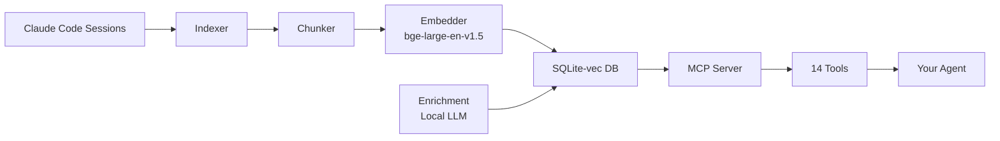

# Dev.to — BrainLayer Tutorial Article

> Post to: https://dev.to
> Format: Tutorial ("How I built X")
> Length: 1,200-2,000 words
> Tags: mcp, ai, python, claudecode, sqlite
> Canonical URL: point to etanheyman.com blog version (if created)

## Title

How I Gave My AI Coding Agent Persistent Memory (And You Can Too in 5 Minutes)

## Article Outline

### Opening (150 words)
- The frustration: "Hey Claude, remember when we..." → blank stare
- The scale: 847 sessions, 268K conversation chunks, 2 years of coding
- The promise: Your AI agent never forgets again

### The Problem: AI Amnesia (200 words)
- Claude Code is incredible at coding — terrible at remembering
- Every session starts from scratch
- Developers repeat context, repeat decisions, repeat mistakes
- The official MCP memory server stores notes in a JSON file with text matching
- We can do better

### The Architecture (400 words, with diagram)
- SQLite-vec for vector storage (single-file, no Docker)
- bge-large-en-v1.5 embeddings (1024 dimensions)
- FTS5 for keyword search
- Hybrid retrieval with Reciprocal Rank Fusion
- LLM enrichment pipeline (local Ollama/MLX)
- 14 MCP tools for different retrieval patterns

[Include Mermaid diagram:]


### 5-Minute Setup (300 words, with code blocks)
```bash
pip install brainlayer
brainlayer init
brainlayer index
```

MCP config for Claude Code, Cursor, VS Code (tabbed examples)

### Real-World Usage (300 words)
- Example 1: "How did I implement auth?" → returns past decision with context
- Example 2: File timeline — see every session that touched a file
- Example 3: Regression detection — what changed since this file last worked?
- Example 4: Store a decision for future reference

### What Makes This Different (200 words)
Comparison table:

| Feature | Official MCP Memory | mem0 | BrainLayer |
|---------|-------------------|------|------------|
| Storage | JSON file | Cloud DB | Local SQLite |
| Search | Text matching | Vector | Hybrid (vector + keyword) |
| API keys needed | No | Yes (OpenAI) | No |
| Enrichment | None | LLM extraction | Local LLM |
| Scale | Small | Large | 268K+ chunks |
| Cost | Free | $19/mo managed | Free (OSS) |

### The Enrichment Layer (200 words)
- Sessions get analyzed by local LLM
- Extracts: decisions, corrections, learnings, mistakes, patterns
- Generates: summary, tags, importance score, intent classification
- All stored alongside the conversation chunks
- Makes search dramatically better

### What's Next (100 words)
- Session-level enrichment pipeline (shipping now)
- Graph memory support (roadmap)
- Temporal awareness (roadmap)
- VoiceLayer — sister project for voice I/O

### CTA
- GitHub link
- Docs link
- "Star the repo if this is useful"

---

## Notes for Etan

- Dev.to tutorial format dramatically outperforms "announcement" posts
- "And You Can Too in 5 Minutes" is the key — people click for the promise of easy replication
- Include real code blocks, not just descriptions
- Mermaid diagrams render natively on Dev.to
- Cross-post to Medium and Hashnode with canonical URL
- Tags matter for discovery: mcp, ai, python, claudecode, sqlite
- End with a genuine "what should I build next?" question to drive comments
