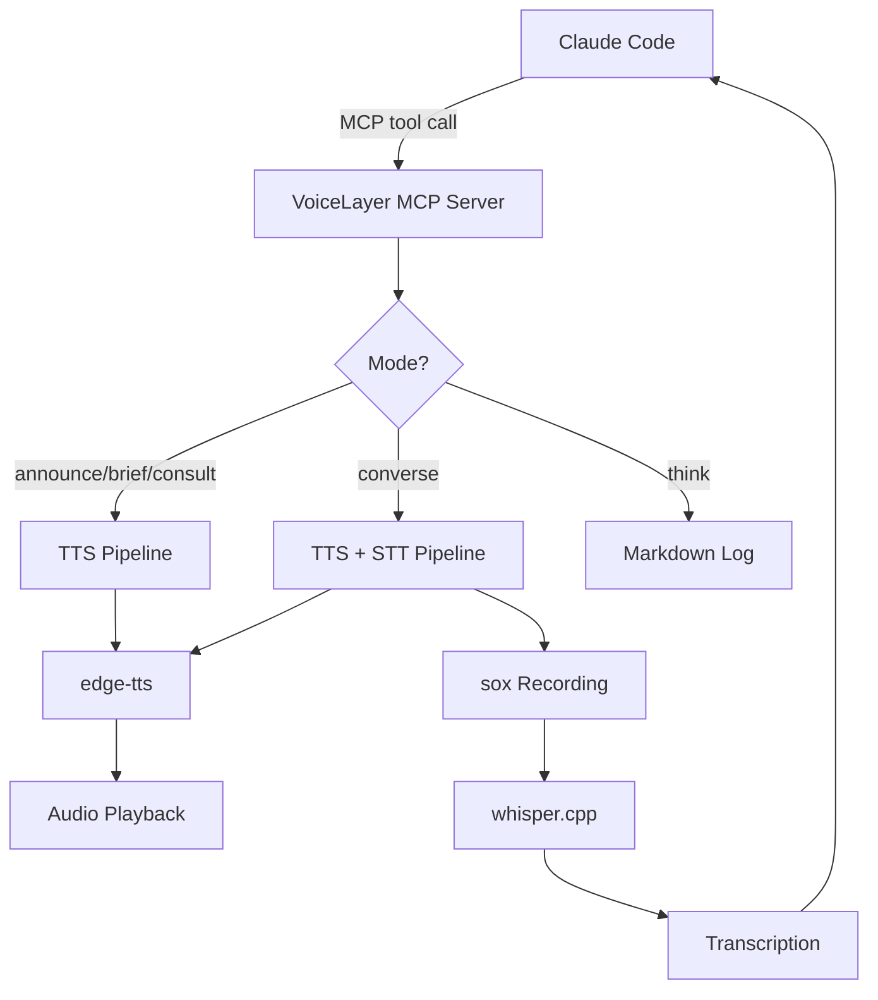

# Dev.to — VoiceLayer Tutorial Article

> Post to: https://dev.to
> Format: Tutorial ("How I built X")
> Length: 1,200-2,000 words
> Tags: mcp, ai, typescript, whisper, voice
> Canonical URL: point to etanheyman.com blog version (if created)

## Title

How I Added Voice to My AI Coding Agent (5 Modes, Local STT, Zero Cloud APIs)

## Article Outline

### Opening (150 words)
- The frustration: typing every interaction with Claude Code
- The realization: QA testing, code reviews, brainstorming are conversations — not typing exercises
- The promise: your AI agent can talk and listen, running 100% locally

### The Problem: Text-Only Agents (200 words)
- AI coding agents are powerful but trapped behind keyboards
- Some workflows are naturally vocal: QA walkthroughs, design discussions, client interviews
- Existing voice AI (Vapi, Retell) is built for telephony — per-minute billing, cloud APIs, business use cases
- What we need: a developer-first, local, MCP-native voice layer

### The Architecture (400 words, with diagram)
- MCP server pattern: agent calls voice tools like any other tool
- 5 modes (7 MCP tools including say/ask aliases) for different interaction patterns
- TTS pipeline: edge-tts → audio file → playback with stop signal
- STT pipeline: sox recording → whisper.cpp with CoreML → transcription

[Include Mermaid diagram:]


### 5-Minute Setup (200 words, with code blocks)
```bash
# Option 1: bunx (no install)
bunx voicelayer-mcp

# Option 2: clone for development
git clone https://github.com/EtanHey/voicelayer.git
cd voicelayer && bun install
```

MCP config for Claude Code:
```json
{
  "mcpServers": {
    "voicelayer": {
      "command": "bunx",
      "args": ["voicelayer-mcp"]
    }
  }
}
```

Cursor and VS Code configs (tabbed examples).

Prerequisites: whisper.cpp compiled with CoreML, sox installed.

### The 5 Voice Modes (400 words)

**announce** — Fire and forget. Agent speaks a status update, keeps working.
```
Agent: qa_voice_announce("Build complete. 47 tests passing.")
→ You hear: "Build complete. 47 tests passing."
→ Agent continues immediately
```

**brief** — One-way explanation. Agent reads back findings at a comfortable pace.
```
Agent: qa_voice_brief("Here's what I found in the auth module: three functions need refactoring...")
→ You listen, absorb, no response expected
```

**consult** — Checkpoint. Agent checks in before taking action.
```
Agent: qa_voice_consult("About to commit these changes. Want to review the diff?")
→ Non-blocking — agent continues, you can respond if you want
```

**converse** — Full bidirectional Q&A. The killer mode.
```
Agent: qa_voice_converse("How does the navigation look on mobile?")
→ Agent speaks the question
→ Your mic activates
→ You answer: "The hamburger menu is cut off on the right side"
→ whisper.cpp transcribes in ~300ms
→ Agent uses your answer to continue work
```

**think** — Silent notes. No audio. Agent writes insights to a markdown log.
```
Agent: qa_voice_think("User seems frustrated with the current layout. Suggesting a complete redesign might be better than incremental fixes.")
→ Categorized as: insight | question | red-flag | checklist-update
→ Written to live thinking log (viewable in split terminal)
```

### Session Booking (200 words)
- Only one voice session at a time (lockfile mutex)
- Other sessions see "line busy" and fall back to text
- User-controlled stop: `touch /tmp/voicelayer-stop` kills recording instantly
- Silence detection (5s) is fallback only — you control when you're done speaking

### Real-World Use Cases (200 words)
- **QA Testing:** Voice-guided website walkthroughs. Agent asks questions about UI, you describe what you see.
- **Discovery Calls:** Interview clients with live `think` mode capturing insights and red flags.
- **Code Review Debriefs:** Agent summarizes changes via `brief`, you discuss tradeoffs via `converse`.
- **Pair Programming:** Agent announces progress, consults on decisions, converses on design choices.

### What Makes This Different (150 words)

| Feature | Vapi | Retell | VoiceLayer |
|---------|------|--------|------------|
| Pricing | $0.05-0.25/min | $0.07-0.33/min | Free (OSS) |
| Hosting | Cloud | Cloud | 100% local |
| STT | Cloud APIs | Cloud APIs | whisper.cpp (local) |
| Target | Business telephony | Customer support | Developer workflows |
| Integration | REST API | REST API | MCP native |
| Voice modes | 1 (conversation) | 1 (conversation) | 5 specialized (7 tools) |

### What's Next (100 words)
- Kokoro TTS via MLX (higher quality, faster on Apple Silicon)
- Larger whisper models for improved accuracy
- Voice activity detection (smarter recording start/stop)
- Integration with BrainLayer (voice search your coding history)

### CTA
- GitHub link
- Docs link
- Sister project: BrainLayer (persistent memory)
- "What voice workflow would be most useful for you?"

---

## Notes for Etan

- Dev.to tutorial format with code blocks will perform well
- The 5 modes section is the core — make each one crystal clear with examples
- Mermaid diagrams render natively on Dev.to
- The comparison table makes the value obvious at a glance
- Cross-post to Medium and Hashnode with canonical URL
- Tags: mcp, ai, typescript, whisper, voice
- "converse" mode examples should be the demo that sells it
- End with a genuine question about use cases — drives comments
- Consider embedding a screen recording at the top (Dev.to supports video embeds)
