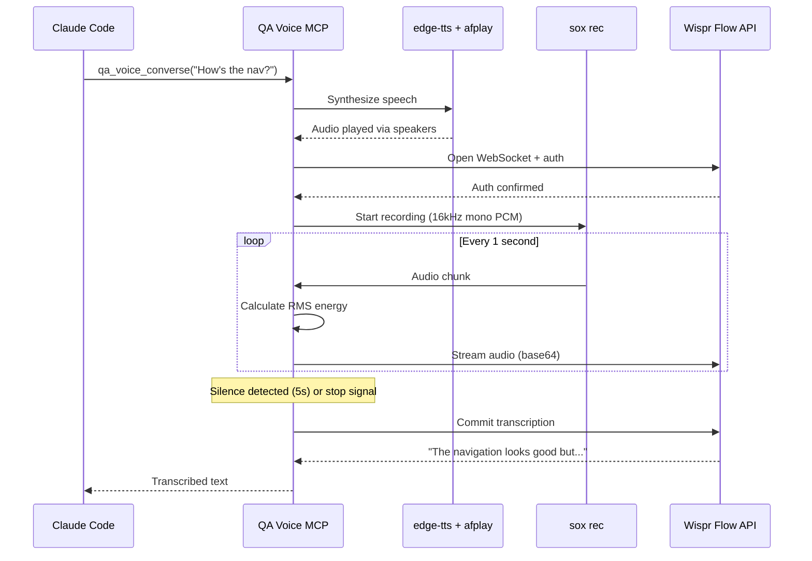
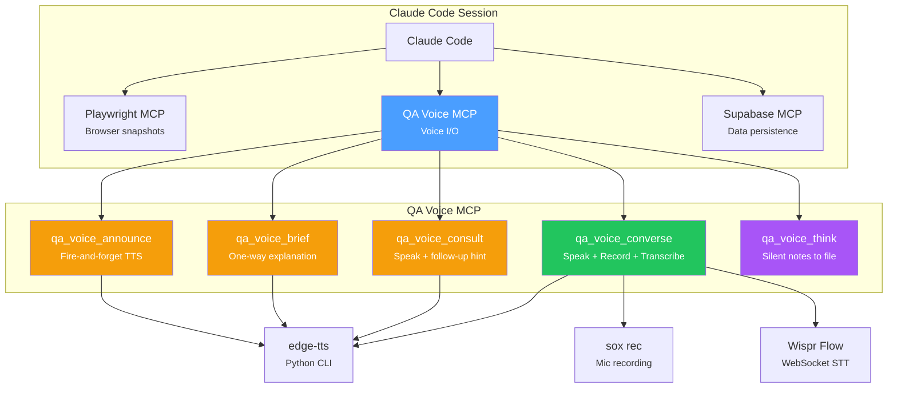
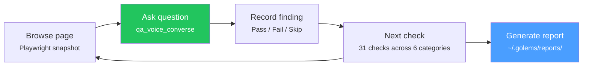
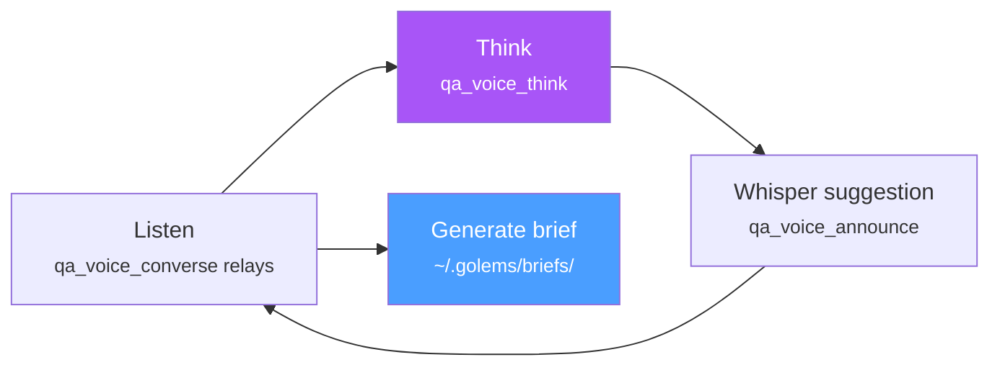
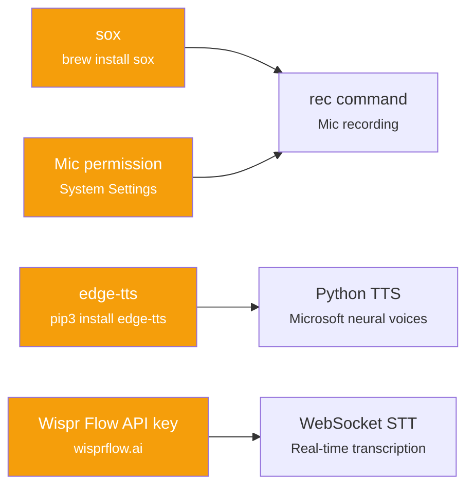

# QA Voice

> Voice-powered QA & client discovery assistant. Speak questions, record responses, transcribe via Wispr Flow — all inside Claude Code.

QA Voice is an MCP server that adds **voice I/O** to Claude Code sessions. It speaks questions aloud via edge-tts, records your voice via sox, and transcribes via Wispr Flow's WebSocket API. No companion terminal, no manual setup — just speak and listen.

## How It Works



## Architecture



## Two Modes

### QA Mode — Website Testing

Systematic website testing with voice. Browse pages with Playwright, speak findings, get structured reports.



**6 QA Categories (31 checks):**

| Category | Checks | What It Tests |
|----------|--------|---------------|
| Accessibility | 6 | Screen readers, keyboard nav, ARIA, contrast, focus |
| Responsive | 5 | Mobile, tablet, desktop breakpoints, touch targets |
| Content | 5 | Copy, spelling, broken links, images, SEO meta |
| Interaction | 5 | Forms, buttons, modals, navigation, error states |
| Performance | 5 | Load time, animations, lazy loading, bundle size |
| SEO | 5 | Meta tags, headings, structured data, sitemap |

- **Agent prompt:** `.claude/agents/qa-voice.md`
- **Schema:** `packages/qa-voice/src/schemas/checklist.ts`
- **Reports:** `~/.golems/reports/qa-{date}-{id}.md`

### Discovery Mode — Client Calls

Client discovery call assistant. Track unknowns, get whispered follow-up suggestions, detect red flags, generate project briefs.



**7 Discovery Categories (22 questions):**

| Category | Questions | What It Covers |
|----------|-----------|----------------|
| Scope | 4 | Project goals, timeline, deliverables |
| Technical | 4 | Stack, integrations, data, APIs |
| Design | 3 | Brand, UI/UX, accessibility needs |
| Content | 3 | Copy, media, CMS, multilingual |
| Budget | 3 | Range, payment terms, ongoing costs |
| Process | 3 | Communication, reviews, handoff |
| Competitive | 2 | Competitors, differentiation |

- **Agent prompt:** `.claude/agents/discovery-voice.md`
- **Schema:** `packages/qa-voice/src/schemas/discovery.ts`
- **Briefs:** `~/.golems/briefs/discovery-{date}-{id}.md`

## MCP Tools

| Tool | Mode | Returns |
|------|------|---------|
| `qa_voice_announce` | Fire-and-forget TTS (status updates, narration) | Confirmation |
| `qa_voice_brief` | One-way explanation TTS (reading back decisions) | Confirmation |
| `qa_voice_consult` | Speak checkpoint + follow-up hint | Confirmation + hint |
| `qa_voice_converse` | Speak + record mic + Wispr Flow STT | Transcribed text (or timeout) |
| `qa_voice_think` | Silent append to thinking log | Confirmation |
| `qa_voice_say` | ALIAS → announce | Confirmation |
| `qa_voice_ask` | ALIAS → converse | Transcribed text |

## Prerequisites



| Dependency | Install | Purpose |
|------------|---------|---------|
| **sox** | `brew install sox` | `rec` command for mic recording (16kHz 16-bit mono PCM) |
| **edge-tts** | `pip3 install edge-tts` | Microsoft neural TTS (free, no API key needed) |
| **Wispr Flow** | [wisprflow.ai](https://wisprflow.ai) | WebSocket speech-to-text API |
| **Mic access** | System Settings > Privacy > Microphone | Grant access to your terminal app (iTerm2, Terminal) |

## Setup

1. Install dependencies:
```bash
brew install sox
pip3 install edge-tts
```

2. Add to your project's `.mcp.json`:
```json
{
  "qa-voice": {
    "command": "bun",
    "args": ["run", "packages/qa-voice/src/mcp-server.ts"],
    "env": {
      "QA_VOICE_WISPR_KEY": "your-api-key-here"
    }
  }
}
```

3. Grant microphone access to your terminal app (System Settings > Privacy > Microphone).

4. In Claude Code, use the QA or Discovery agent prompt:
   - QA: `.claude/agents/qa-voice.md`
   - Discovery: `.claude/agents/discovery-voice.md`

## Environment Variables

| Variable | Default | Description |
|----------|---------|-------------|
| `QA_VOICE_WISPR_KEY` | *(required)* | Wispr Flow API key for WebSocket STT |
| `QA_VOICE_TTS_VOICE` | `en-US-JennyNeural` | edge-tts voice ID ([voice list](https://learn.microsoft.com/en-us/azure/ai-services/speech-service/language-support)) |
| `QA_VOICE_TTS_RATE` | `+15%` | Speech rate adjustment (`-50%` to `+100%`) |
| `QA_VOICE_SILENCE_SECONDS` | `2` | Seconds of silence before speech end detection |
| `QA_VOICE_SILENCE_THRESHOLD` | `500` | RMS energy threshold for silence (0-32767) |
| `QA_VOICE_THINK_FILE` | `/tmp/golems-qa-thinking.md` | Path for live thinking log |

## Output Files

| Type | Path | Format |
|------|------|--------|
| Sessions | `~/.golems/sessions/{id}.json` | JSON — raw session data |
| QA Reports | `~/.golems/reports/{id}.md` | Markdown — pass/fail summary with findings |
| Discovery Briefs | `~/.golems/briefs/{id}.md` | Markdown — project brief with red flags |
| Thinking Log | `/tmp/golems-qa-thinking.md` | Markdown — timestamped notes (live) |

## Wispr Flow Integration

- **Protocol:** WebSocket streaming (`wss://platform-api.wisprflow.ai/api/v1/dash/ws`)
- **Auth:** API key as query parameter
- **Audio:** 16kHz, 16-bit signed, mono PCM via sox `rec`
- **Chunking:** 1-second chunks streamed in real-time
- **Silence detection:** RMS energy monitoring with configurable threshold and duration

## Troubleshooting

**"sox not installed" error:**
```bash
brew install sox
# Verify: which rec
```

**"edge-tts failed" error:**
```bash
pip3 install edge-tts
# Verify: python3 -m edge_tts --list-voices | head
```

**No audio recorded (silent mic):**
- Check microphone permissions: System Settings > Privacy > Microphone
- Use iTerm2 or Terminal.app (Zed IDE doesn't propagate mic permissions correctly)
- Test mic: `rec -d -r 16000 -c 1 -b 16 test.raw` — you should see audio levels

**Wispr auth timeout:**
- Verify API key: `echo $QA_VOICE_WISPR_KEY`
- Check Wispr Flow status at [wisprflow.ai](https://wisprflow.ai)

## Source

- **Package:** [`packages/qa-voice/`](https://github.com/EtanHey/golems/tree/master/packages/qa-voice)
- **CLAUDE.md:** [`packages/qa-voice/CLAUDE.md`](https://github.com/EtanHey/golems/blob/master/packages/qa-voice/CLAUDE.md)
- **QA Agent:** [`.claude/agents/qa-voice.md`](https://github.com/EtanHey/golems/blob/master/.claude/agents/qa-voice.md)
- **Discovery Agent:** [`.claude/agents/discovery-voice.md`](https://github.com/EtanHey/golems/blob/master/.claude/agents/discovery-voice.md)
